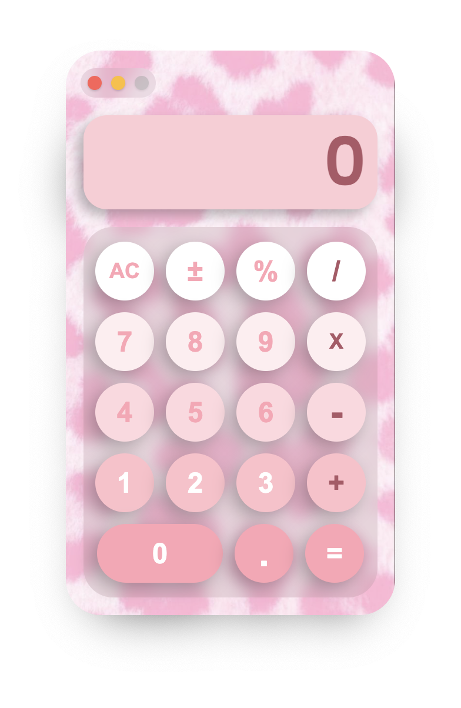

# 💖 Pink Desktop Calculator App

A beautifully designed calculator desktop app built using **Electron**, **HTML**, **CSS**, and **JavaScript**. This app features smooth UI, custom Mac-style window buttons, keyboard support, and responsive sound effects — all wrapped in a soft, pastel pink theme.

---

## ✨ Features

- 🧮 Basic arithmetic operations (+, –, ×, ÷)
- 🎀 Cute pink UI with glassmorphism effects and rounded corners
- 🔘 Custom Mac-style control buttons (Close, Minimize, Disabled Maximize)
- 🔊 Unique sound effects for:
  - Number buttons
  - Operators
  - Delete (⌫)
  - Equals (=)
  - AC (All Clear)
- 💻 Keyboard support for full interaction
- 🖱️ Click effects with realistic button press animation
- 🪟 Frameless, draggable, transparent window
- 📦 Packaged for both **macOS** and **Windows**

---

## 📸 Preview



---

## 🚀 Getting Started

### 1. Clone the repo

```bash
git clone https://github.com/aadicodesforfun/calculator-app
cd calculator-app
```

### 2. Install dependencies

```bash
npm install 
```

### 3. Run the app

```bash
npm start
```

### 4. Build the app (Optional)

```bash
npm run build
```

---

## 📃 License

Free to use and modify for personal or educational purposes

Made with ❤️ by Aditya Tripathi